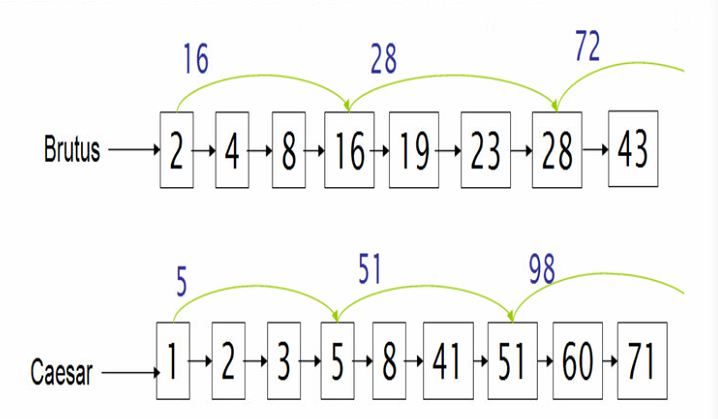
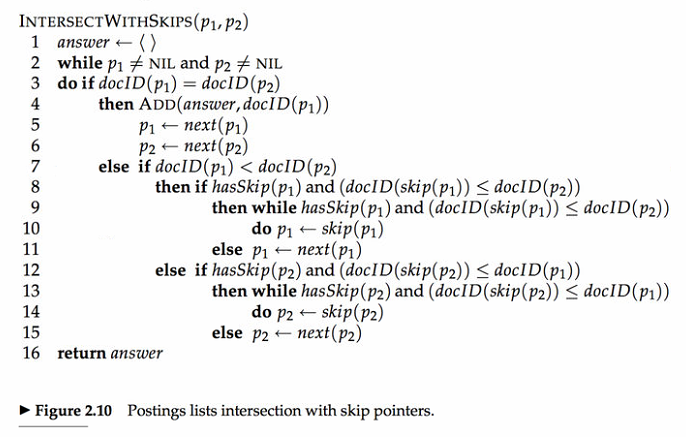
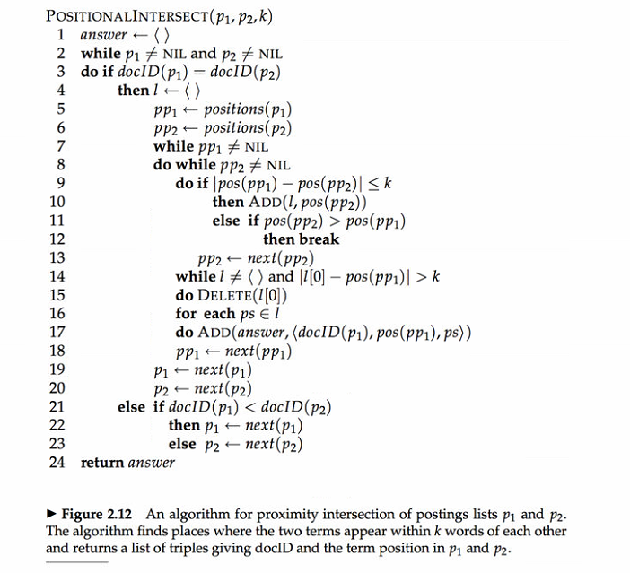
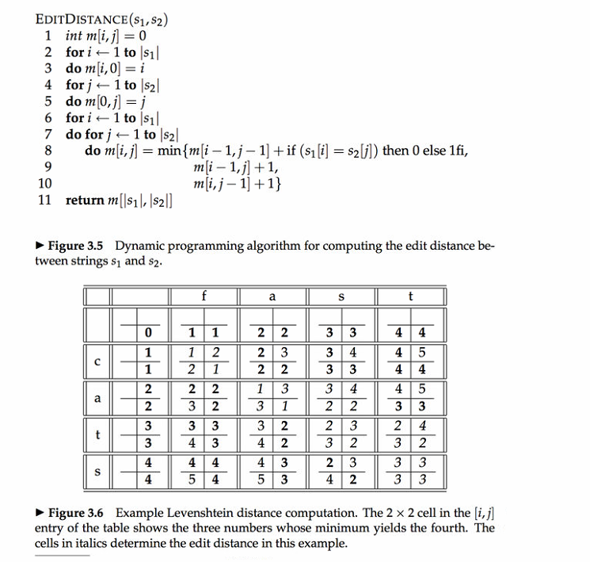
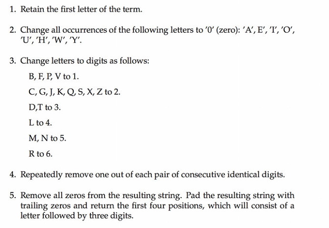

##Dictionaries and tolerant retrieval 词典、倒排记录表和容错式检索
###Faster postings list intersection via skip pointers 基于跳表指针(skip points)的倒排索引记录表(posting lists)合并算法 
>Skip point is the ways to increase the efficiency of using postings lists.Skip point can also be applied in ordered array merging.But postings list intersection only need to find the same elements. 
>基于跳表指针的合并算法是对倒排索引记录表的合并的一种优化.但其实可以运用在更多的场景,例如两个排好序的数组的归并成一个有序数组,利用跳表指针的方法也可以提高归并效率.但是倒排索引表的合并是找出相同的元素.

 
Suppose we’ve stepped through the lists in the figure until we have matched"8"   on each list and moved it to the results list. We advance both pointers, giving us "16" on the upper list and "41" on the lower list. The smallest item is then the element "16" on the top list. Rather than simply advancing the upper pointer, we first check the skip list pointer and note that 28 is also less than 41. Hence we can follow the skip list pointer, and then we advance the upper pointer to "28". We thus avoid stepping to "19" and "23" on the upper list. --From *Introduction to Information Retrival* 
假定现在两个表的指针都落在相同元素"8"上,所以均往前走一步,第一个表的指针移到"16"处,第二个表的指针移到"41"处,第一个表的指针的元素较小,并且该位置有跳表指针指向"28",还是小于"41",所以直接将第一个表的指针移到"28"处.

A simple heuristic for placing skips, which has been found to work well in practice, is that for a postings list of length P, use √P evenly-spaced skip pointers. 
在每个√P处均匀的放置跳表指针,其中P是posting list的长度,这个设置比较简单且效果不错.但是显然也没有考虑分布细节了.

 
code:`skipretrival.java`

###邻近搜索（proximity search）中的两个倒排记录表（postings lists）的合并算法。
 
code:`posIntersect.java`

###基于动态规划（dynamic programming）的计算两个字符串的编辑距离（edit distance）的算法。
 
code:`EditDis.java`

###基于发音的校正技术（phonetic correction）。
 
code:`Soundex.java`